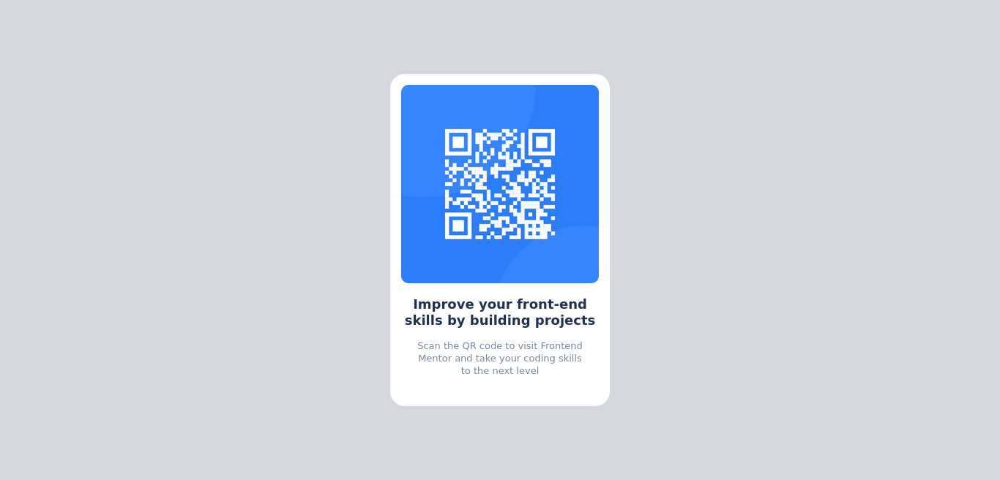

# QR code component layout

## This project is a QR component used for testing my layout skill

## Overview

* Centering of object
* Centering of image
* Aligning of text

### Screenshot

### Built with

- Semantic HTML5 markup
- CSS custom properties
- vscode editor

### What I learned

I was able to understand the BEM methodolody(BLOCK ELEMENT MNODIFIER) since am just starting to learning, it awesome been equipped with such knowledge becuase it gives a very detailed information about a particular section or design in a web space.

## Author

- Author Name - Orisabiyi David
- Frontend Mentor - (https://www.frontendmentor.io/profile/Orisabiyi)

## Links
- Solution URL - https://github.com/Orisabiyi
- Live Site URL - 

## MY PROCESS

On coming across this layout project, I first thought of the various ways to make use to successfully produce a replicate of the page then move on to coding the layout. My thought process listed below;

- The body will contain the background-color,
- I then decided to create a container to accomodate all of the other components e.g the qr-image, text etc,
- Then centered the container,  using the position, translate, top amd left properties,
- Placed the image in a container to center it using margin: auto; property
- Decided to place the text in a container to create a clean code and also seperate both text from the image nicely and neatly.

The above list is my thought process in short for comprenhensive understanding, you can check out my code from my github account which is above.

## NOTICE
This website is only optimized for Desktop and Mobile(ranging from 0 - 600).
I majorly used th rem units for easy responsiveness of the page which lead to shorter code in my media query.
I also used two breakpoints for my mobile view, one is for the recommended mobile view (375px) while the second is for all mobile view (600px).